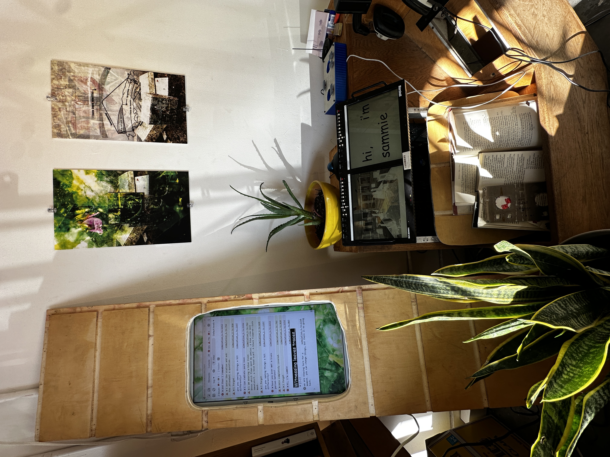
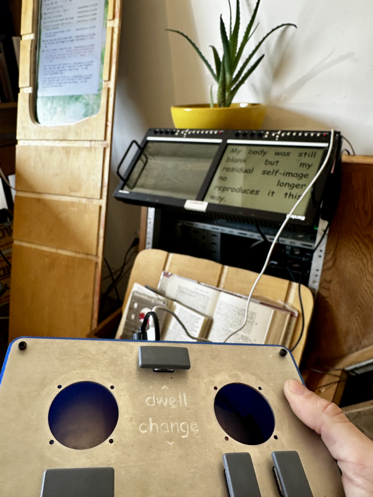

# *FREE COMPUTER (Archive #1)*

*Every part of this computer, aside from the 12$ graphics card, was free. It is one transient home for over 5,000 media artifacts spanning 10 years of digital life. The furniture was found on the street. The rackmounted monitors were acquired through an eBay scam. The archive can sit comfortably in four inches of water. Its components are basically fungible. This is a first attempt to develop something like a digital vitrine// altar for this archive spanning two lives. Art, posts, gathered files, and field recordings surface and mix serendipitously, triggered by paragraphs from [Dead Name](https://deadname.online). The browser console returns echoes from the future. A controller repurposed from Memory Terminal offers two choices: dwell and change. Witnessing leaves traces, and you can’t go back.*

## About

*FREE COMPUTER*  is a serendipitous archival media synthesizer which showed in EDEN, a 2024 group exhibition curated by Emily Lucid at Las Projects in Los Angeles. The installation software is based on Carrier Bag: a locally hosted, browser-based filesystem instrument I created during my residency in the [0xSalon](https://0xsalon.pubpub.org/) at [Trust](https://trust.support). Carrier Bag uses [Hydra Video Synth](https://github.com/hydra-synth/hydra) to blend three layers of visual media together, along with two layers of audio, with controls for randomly or programmatically loading files, switching blend modes, and time stretching media. 

While I initially developed Carrier Bag as a performance tool, the *FREE COMPUTER*  variant is designed for multichannel physical installation, with separate windows for text, visuals and browser console. It loads every paragraph element from a given HTML file into an array of objects, which store randomizing functions that affect the visual layer each time the text advances. If the text contains certain keywords, it will load media which contains those keywords. As functions fire in the software, the console logs fragments of poetry and shitposts as errors and warnings. 

## Controls

The installation can be controlled with four interactions:

- Dwell: pause automatic text advancement and save the current visual state in the current text state
- Next: advance text and randomize visual layer
- Blend: change blend mode for a random file currently loaded in the visual layer
- Random Time: if time based media is loaded, randomize current time of one file
    
    
    

On your computer, these keys are mapped to WASD respectively. If you investigate the event listeners in index.html, you can find some other vestigial controls for more direct interaction. 

## How to run *FREE COMPUTER* at home using your own media:

*This tutorial is geared toward people who may have never written a line of code, or run a script downloaded from GitHub. I am a novice myself. Feedback always welcome <3*

## Prerequisites:

- Python
    - Open a terminal and enter the following to check if your computer has Python installed
        - Windows: `python --version`
        - Mac: `python --version` OR `python3 --version`
    - If the terminal gives you an error like ‘command not found,’ install Python. It is a little more annoying to do on Mac than PC, but I believe in you.
- Text editor ([VSCode](https://code.visualstudio.com/) or similar)

## Installation
1. Once you have completed the prerequisites, download this repository by clicking on the green “<>Code” button, and select “Download ZIP”
2. Once the file is downloaded, extract it. 
3. Open VSCode and navigate to File→ Open Folder 
4. Select *FREE COMPUTER* and open it. 
5. Copy whatever folders of media you wish to use into the Library folder. They can be loose files or folders, they don’t need to be in any particular structure, or conform to any filetype. Carrier Bag will load:
    - images (jpg, png)
    - video (mov, mp4)
    - audio (mp3 and wav)
6. Inside the main folder, double-click `start (macOS, Linux)` or `start.bat (Windows)` to launch Carrier Bag. Your default browser should open automagically. (*If not, please do so and navigate to* `http://localhost:8080`)
7. This will open two windows, one black one white. Move each window to the desired screen. Clicking within either window will enter full screen mode. 
8. Press either the `A` key or the right arrow key to begin loading media files. 
9. But what if you want your own text instead of mine! 
10. First you need an HTML file. Really you just need a text file where every paragraph is surrounded by `
`[your paragraph] `
`. If your writing is in another format, there are also free html convertors online. Save your text as .html and drag it in to the *FREE COMPUTER* directory. 
11. Open simulation1.js and at line 33, replace the filename of textWindow to “[your-filename].html”
12. Make sure to save simulation1.js after you made your edit, then reload the windows.